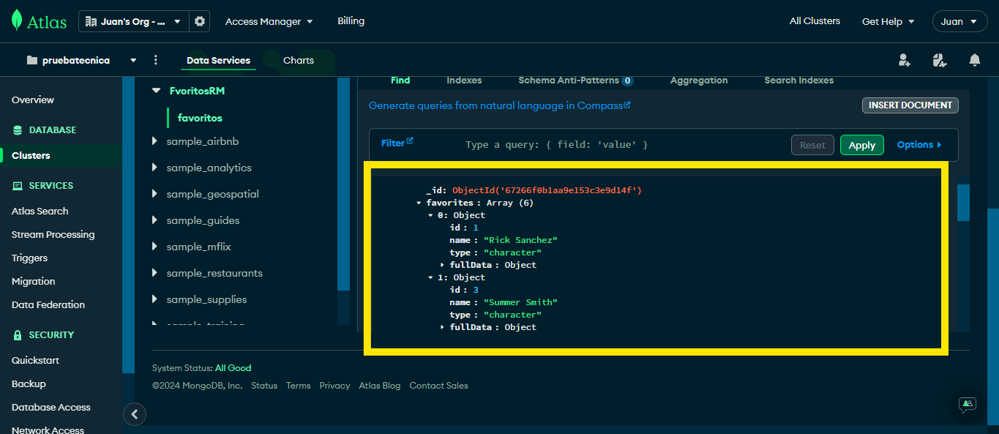

# Nombre del Proyecto

Este proyecto es una API RESTful desarrollada con Node.js y Express.js que permite gestionar una base de datos MongoDB. La aplicación implementa operaciones CRUD (Crear, Leer, Actualizar y Eliminar) para manejar datos de manera eficiente y segura. Ideal para servicios backend que requieren persistencia de datos y una interfaz API robusta.

## Tecnologías Utilizadas

- Node.js
- Express.js
- MongoDB
- React.js
- Next.js
- Tailwind CSS
- Google Fonts

## Instalación

1. Clonar el repositorio:

    ```bash
    git clone https://github.com/usuario/nombre-del-proyecto.git
    ```

2. Navegar al directorio del proyecto:

    ```bash
    cd nombre-del-proyecto
    ```

3. Instalar las dependencias:

    ```bash
    npm install
    ```

## Imagen datos en MongoDB


